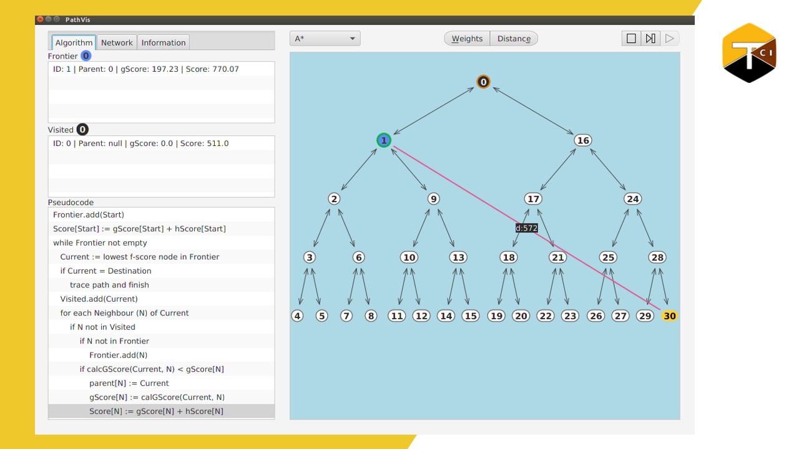

# pathvis
Pathfinding algorithm visualizer where users can create weighted, directional graphs using their mouse. Includes A* (A Star), BFS (Breadth First Search), DFS (Depth First Search), and Uniform Cost Search. Useful for those looking to teach and learn path finding. Psuedocode is visualized too.

[Youtube tutorial series playlist](https://www.youtube.com/watch?v=VhMJF2Iau4s&list=PLEj_WYZ-VQAOewuCEVzB_JgZgZH_B0-D1)

[Youtube application overview](https://youtu.be/BJCJKNVF6fQ)

